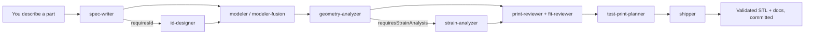

# Getting Started

Clone this repo, run one setup script, launch Claude Code inside it, and describe a part. The agents and validation pipeline do the rest — you get a printable, reviewed STL without touching CAD. This page is the full setup path, from a fresh machine to your first shipped part.

## Quickstart

Five steps to your first part.

```bash
git clone https://github.com/harteWired/ai-3d-modeling.git
cd ai-3d-modeling
sudo bash setup.sh        # OpenSCAD + Xvfb + PrusaSlicer + Python venv
npm install && npm test   # Node tooling + verify the repo is healthy
claude                    # launch Claude Code in the repo root
```

Then, in Claude Code:

```
Design a wall bracket for a 35 mm conduit, two M4 screw holes 60 mm apart.
```

Claude reads `CLAUDE.md` on launch, runs the spec → model → validate → review pipeline, and writes the result to `designs/<name>/`. Ask it to render or ship when you're happy.

> [!NOTE]
> `setup.sh` uses `apt-get`, so it targets Debian/Ubuntu (this repo was built in a devcontainer). On other systems, install OpenSCAD, PrusaSlicer, and Python 3 yourself, then run the `python3 -m venv .venv && .venv/bin/pip install -r requirements.txt` step by hand.

## What you need

**Required:**

1. **[Claude Code](https://docs.anthropic.com/en/docs/claude-code)** — the workflow is driven entirely through it.
2. **git** and a **Debian/Ubuntu-based shell** with `sudo` (for `setup.sh`).
3. **Node.js 18+** — the validation CLI is ESM and uses the built-in `node --test`.
4. **Python 3** — trimesh, manifold3d, and friends run in a local `.venv`.

`setup.sh` installs the rest: **OpenSCAD** (parametric modeling), **Xvfb** (headless rendering), and **PrusaSlicer** (ground-truth slice checks).

**Optional:**

- **Blender** — for the warm studio "hero" renders. Install with `bash scripts/install-blender.sh`. The pipeline works fine without it; you just skip the gallery renders.
- **Autodesk Fusion 360** — a second modeling backend for organic, freeform geometry. Needs Fusion running on a Windows host with the MCP add-in and a bridge to the container. See [`fusion-mcp-setup.md`](fusion-mcp-setup.md). OpenSCAD is the default and needs none of this.
- **Gemini MCP** — used to validate renders during iteration. Optional; the pipeline degrades gracefully without it.

## What's in the repo

Cloning gets you everything. The pieces that matter:

| Path | What it is |
|---|---|
| `CLAUDE.md` | Project instructions Claude Code auto-loads — printer specs, FDM tolerances, conventions. The brain. |
| `AGENT-WORKFLOW.md` | The orchestration guide — which agent runs when, by design complexity. |
| `.claude/agents/` | The 10 specialized agents (spec-writer, modeler, reviewers, shipper, …). Tracked in git, so they ship with the clone. |
| `.claude/settings.json` | Claude Code settings for the project. |
| `.mcp.json` | MCP server wiring (the Fusion backend). |
| `scad-lib/` | Shared OpenSCAD libraries — `fdm-pla.scad`, `bambu-x1c.scad`, Gridfinity modules. |
| `bin/` | The validation CLIs — `validate.js`, `geometry-analyze.js`, `check-assembly.js`, `strain-analyze.js`, `render-hero.js`. |
| `python/` | trimesh / PyVista analysis backends the CLIs call. |
| `scripts/` | Blender render scripts and the Fusion MCP bridge. |
| `designs/` | Every shipped design — `requirements.md`, `spec.json`, the model source, and `output/`. Read these as worked examples. |
| `docs/` | The design pages (one per model) and this guide. |
| `setup.sh` · `requirements.txt` · `package.json` | The setup surface. |

Start by reading one finished design — `designs/caterpillar-capsule-holder/` is a good one — to see the shape of the inputs and outputs.

## How the workflow runs

You describe a part. An orchestrator dispatches specialized agents, each with its own context window, handing off through files rather than chat history. Simple parts take a short path; assemblies take the long one.



- **spec-writer** turns your brief into `requirements.md` + `spec.json`, screening for printability conflicts.
- **id-designer** runs only for parts with a face or motif (`requiresId: true`) — a conversational, mockup-first aesthetic pass.
- **modeler** writes OpenSCAD (default) or **modeler-fusion** drives Fusion, iterating against validation until it passes.
- **geometry-analyzer**, **print-reviewer**, **fit-reviewer**, and the opt-in **strain-analyzer** check the mesh against FDM/PLA limits and the spec.
- **test-print-planner** breaks fit-critical interfaces into minimal test pieces.
- **shipper** commits, tags, and pushes.

`AGENT-WORKFLOW.md` has the full dispatch rules. You rarely invoke agents by hand — describe the part and let the orchestrator route it.

## Everyday commands

```bash
node bin/validate.js designs/<name>                 # full render + analysis pipeline
node bin/validate.js designs/<name> --render-only    # render, skip analysis
node bin/validate.js designs/<name> --analyze-only   # analysis, skip render
node bin/geometry-analyze.js designs/<name>          # mesh + slicer analysis
node bin/strain-analyze.js designs/<name>            # closed-form bending stress (opt-in)
node bin/check-assembly.js assemblies/<name>.json    # multi-part interference + fit
npm test                                             # run the test suite
```

## The printer

Everything targets a **Bambu Lab X1 Carbon**: 256 × 256 × 256 mm build volume, 0.4 mm nozzle, 0.2 mm default layer height, PLA. The FDM tolerance table in `CLAUDE.md` (press / clearance / sliding fits, min wall, max overhang) is what the reviewers check against. Retarget it for a different printer by editing `CLAUDE.md` and `scad-lib/bambu-x1c.scad`.

## Troubleshooting

- **`openscad: command not found`** — rerun `sudo bash setup.sh`; it installs OpenSCAD and Xvfb.
- **Python import errors** — the deps live in `.venv`. The CLIs call `.venv/bin/python3` directly; if you added a package, reinstall with `.venv/bin/pip install -r requirements.txt`.
- **PrusaSlicer checks skipped** — the CLI is optional and non-fatal. Slice analysis falls back to trimesh-only.
- **Fusion backend won't connect** — that's the Windows bridge, not the container. Work through [`fusion-mcp-setup.md`](fusion-mcp-setup.md); OpenSCAD designs need none of it.
- **No hero renders** — Blender isn't installed. Run `bash scripts/install-blender.sh`, or skip them.

## Where to go next

- Read `AGENT-WORKFLOW.md` for the orchestration detail.
- Browse `designs/` for worked examples across both backends.
- Open a finished design page in `docs/` to see what "shipped" looks like end to end.

Now describe a part.
