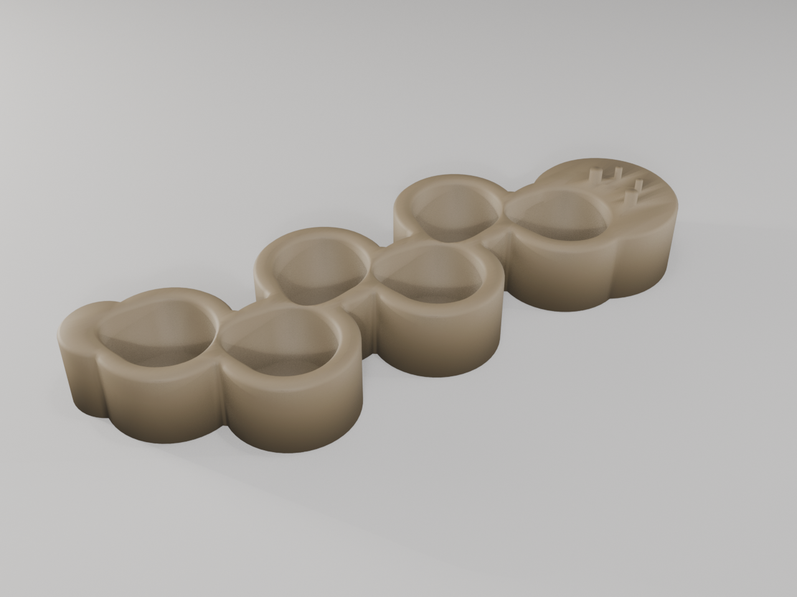
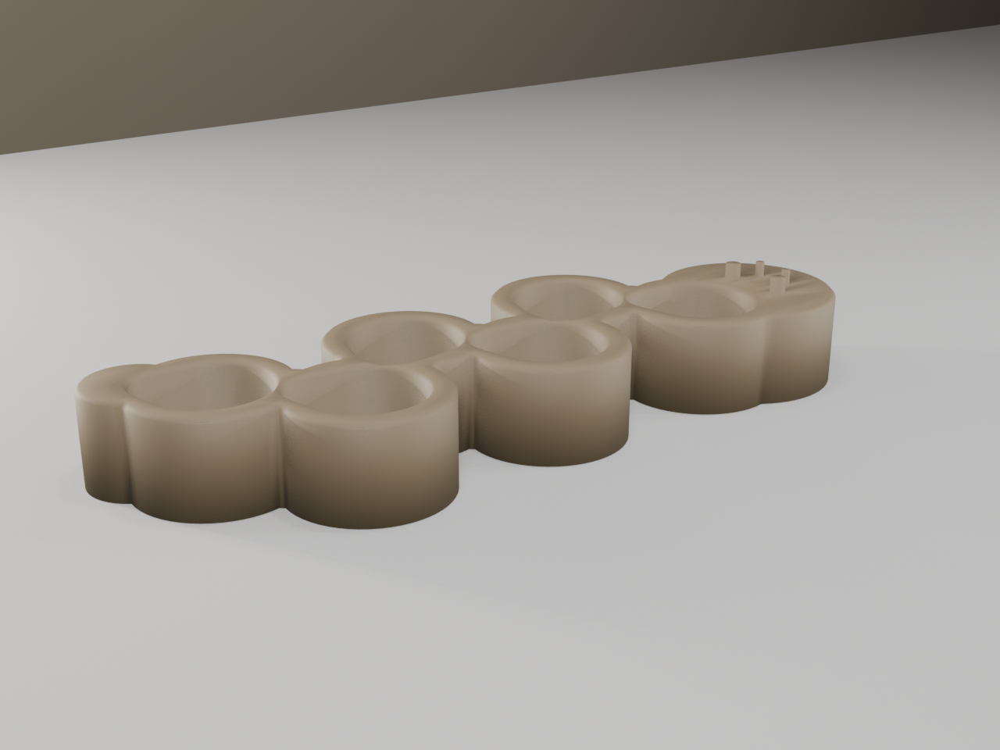

# Battery Capsule Holder (Fusion)

A drawer rack that holds **6 battery capsules** upright, beaker-rack style, gripping the lower body of each asymmetric teardrop capsule in a blind socket so they stand vertical and drop in either end up. Built on the **Fusion 360** backend.

> **Two versions:** **v2** (headlined below) is the current design — a refined **zig-zag caterpillar** with tighter nesting and a segmented body. **v1** (further down) was a **one-shot model test** — a single modeling pass, no iteration — kept as the documented baseline v2 was refined from.

> **Sibling design:** there is a separate [Battery Capsule Holder (OpenSCAD)](battery-capsule-holder-openscad.md) for the same brief. This Fusion build is a **clean-room independent design** — the agent that made every geometry decision was deliberately walled off from the OpenSCAD solution (it never saw the `.scad`, `spec.json`, or those renders) and worked only from the problem statement: calipered capsule dims, capacity, fit type, and drawer context. The two are meant to be compared side-by-side.

## v2 — Zig-Zag Caterpillar (current)

The refined iteration: the 6 teardrop sockets are strung into a single **zig-zag chain** — alternating ±10 mm in Y as they march along, each teardrop pointing nose-to-tail at the next so consecutive capsules **nest**. The interlock is the caterpillar crawl, and it packs *tighter* than v1 (thinnest inter-socket wall ~1.45 mm vs v1's 2.0 mm). The body is one continuous **segmented caterpillar** silhouette with a rounded **head** (two eye dimples + two antenna nubs) and a tapered **tail**.


*v2 hero — six 18 mm teardrop sockets in a nose-to-tail zig-zag chain; segmented caterpillar body, head with eyes + antennae, tapered tail*


*v2 top-down — the zig-zag chain; ~42° spine, ~1.45 mm walls between nested pockets*


*v2 front three-quarter — one bulged caterpillar segment per capsule, deep sockets*

| Dimension | Value | Notes |
|-----------|-------|-------|
| Bounding box | 169.1 × 61.5 × 24.5 mm | z incl. 3.5 mm antenna nubs |
| Layout | zig-zag chain, ±10 mm, 22.3 mm pitch | ~42° spine; nose-to-tail nested |
| Socket | 28.5 × 24.4 mm, 18 mm deep | floor z = 3.0 mm (ray-cast verified) |
| Thinnest wall | ~1.45 mm | ≥ 1.2 floor; tuned by wall optimizer |
| Volume | 77.7 cm³ | watertight single body |
| Print | flat, sockets up, support-free | vertical walls, 45° lead-ins |

Downloads: [`v2 STL`](../designs/battery-capsule-holder-fusion/v2/output/battery-capsule-holder-fusion-v2.stl) · [`v2 build.py`](../designs/battery-capsule-holder-fusion/v2/build.py) · [`v2 modeling report`](../designs/battery-capsule-holder-fusion/v2/modeling-report.md)

---

## v1 — One-Shot Baseline

The original single-pass build (no iteration) — kept for the comparison.


*v1 hero — six deep teardrop sockets (18 mm) with vertical walls and 45° lead-in chamfers, in a 3 mm-filleted slab; alternate pockets flipped 180° to interlock*


*v1 top-down — staggered-brick layout: two outer columns + an offset, flipped middle column*


*v1 front three-quarter — 21 mm slab, filleted edges, recessed teardrop sockets*

## v1 Design Overview

The same calipered capsule (**27.8 × 23.7 mm** teardrop, **69 mm** tall) and the same functional rules (outer-grip only, never the bore; 18 mm blind socket; loose drop-in either end up; non-slip drawer base) — but a different form language. Where the OpenSCAD build leans organic (a curved superellipse dune-hull that tapers inward), this build leans **geometric and tidy**: a single low rounded-rectangle slab with soft-filleted edges that reads as one clean drawer tile.

```
       rounded-rectangle slab footprint (80.4 × 73.9 mm)
     ╭───────────────────────────────────────╮
     │   ◖      ◗      ◖     staggered brick  │   each socket 28.5 × 24.4 mm
     │       ◗      ◖      ◗  middle col 180° │   (0.35 mm/side loose drop-in)
     ╰───────────────────────────────────────╯
        3 mm filleted edges     1.0 × 45° rim lead-ins
        4 ⌀15 rubber-pad recesses underneath
```

## Geometry

| Dimension | Value | Notes |
|-----------|-------|-------|
| Bounding box | 80.4 × 73.9 × 21.0 mm | rounded-rect slab, 3 mm edge fillets |
| Capacity | 6 capsules | staggered brick (2 outer cols + offset middle col) |
| Socket profile | 28.5 × 24.4 mm | capsule 27.8 × 23.7 + 0.35 mm/side |
| Socket depth | 18.0 mm | blind; floor at z = 3.0 mm (ray-cast verified) |
| Thinnest inter-socket wall | 2.0 mm | ≥ 1.2 mm floor; verified over all 15 pocket pairs |
| Outer margin | 4.0 mm | wall around the socket cluster |
| Rim lead-in | 1.0 mm × 45° chamfer | each of 6 sockets |
| Edge fillet | 3.0 mm | vertical + top edges (bottom left sharp for flat print) |
| Floor | 3.0 mm | solid; nothing enters the capsule bore |
| Volume | 68.2 cm³ | watertight / manifold |

## Printability

Single orientation, sockets up, no supports. Pocket walls are vertical; the only
overhang features are the 45°-capped rim chamfers. Bottom edge is left sharp (no
bottom fillet) for a clean first layer.

| Check | Result | Notes |
|-------|--------|-------|
| Overhangs | PASS | vertical socket walls; chamfers ≤ 45° |
| Bridges | PASS | none — blind sockets, solid floor |
| Thin walls | PASS | thinnest inter-socket wall 2.0 mm (≥ 1.2) |
| Watertight | PASS | manifold, 6,348 triangles |

## vs the OpenSCAD build

| | [OpenSCAD](battery-capsule-holder-openscad.md) | Fusion (this page) |
|---|---|---|
| Outer body | superellipse n = 2.6 dune-hull, tapers inward | rounded-rect slab, 3 mm edge fillets |
| Footprint | 89 × 68 mm | 80.4 × 73.9 mm |
| Layout | nested 3 × 2 | 2 outer cols + offset middle col |
| Pocket depth / floor | 18 / 3 mm | 18 / 3 mm |
| Clearance | 0.35 mm/side | 0.35 mm/side *(converged)* |
| Min wall | 2.0 mm | 2.0 mm *(converged)* |
| Non-slip | 4× ⌀10 × 1 mm recesses | 4× ⌀15 × 1.2 mm pad recesses |
| Lead-in | 1.5 mm chamfer | 1.0 mm chamfer + 3 mm outer fillet |
| Volume | 46.4 cm³ | 68.2 cm³ (~47% heavier) |

Both converged independently on the fit-critical numbers (0.35 mm clearance, 2.0 mm
min wall); they diverge most on outer form and material efficiency — the dune-hull
tapers away ~22 cm³ that the slab keeps.

## Downloads

| File | Description |
|------|-------------|
| [`battery-capsule-holder-fusion.stl`](../designs/battery-capsule-holder-fusion/output/battery-capsule-holder-fusion.stl) | Print-ready mesh (watertight) |
| [`build.py`](../designs/battery-capsule-holder-fusion/build.py) | Reproducible Fusion build script |
| [`modeling-report.md`](../designs/battery-capsule-holder-fusion/output/modeling-report.md) | Clean-room rationale + validation |
| [`MEASUREMENTS.md`](../designs/battery-capsule-holder-fusion/MEASUREMENTS.md) | Caliper data (shared with the OpenSCAD build) |

Built with the Fusion 360 MCP backend (clean-room dispatch).
