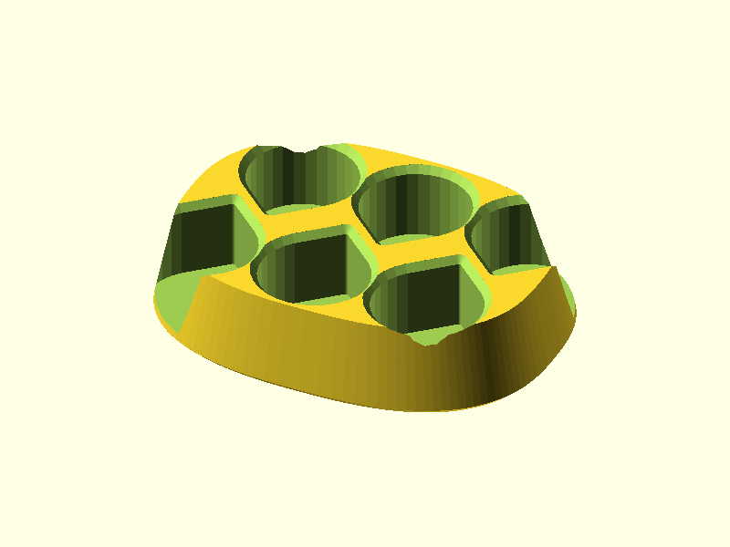
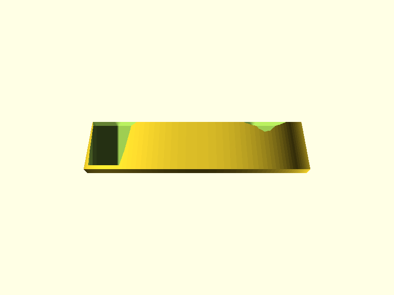
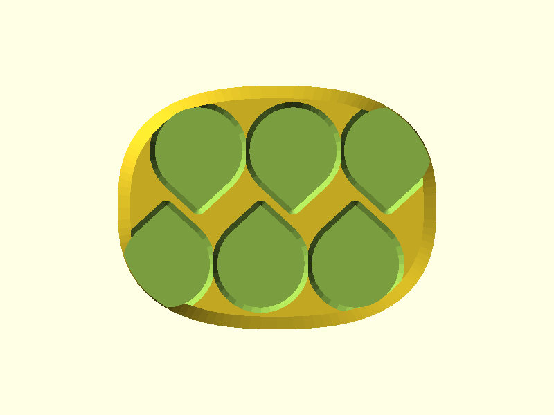
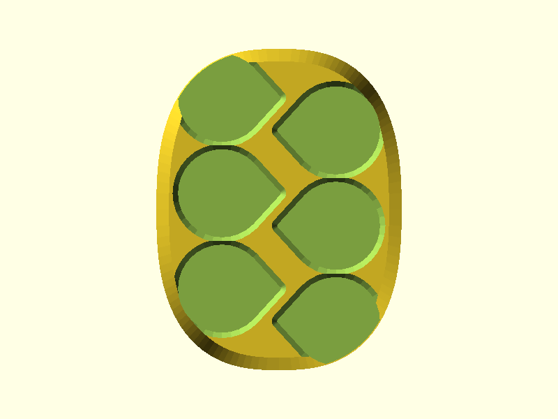

# Battery Capsule Holder

An organic drawer rack that holds **6 battery capsules** upright, lab-beaker-rack style. Each capsule is an asymmetric teardrop tube (a clear half + a teal half that attach to close, batteries inside); the rack cradles the lower body in a blind socket so the capsules stand vertical, drop in and out one-handed, and pack densely by nesting alternate teardrops nose-to-tail.

> **Backend:** OpenSCAD (v1, this page). A **[clean-room Fusion alternate](battery-capsule-holder-fusion.md)** — a filleted-slab redesign built independently from this one (the agent never saw this solution) — is also available for side-by-side comparison.

## Renders


*Isometric — six nested teardrop sockets (alternate rows flipped 180°, points tucked into neighbours' round-back gaps); the dune-hull body swells at the base and draws inward toward the lead-in chamfers at the mouths*


*Top-down — nested 3×2 socket cluster inside the curved superellipse footprint (89 × 68 mm, no straight edges)*


*Front elevation — 20 mm tall; outer wall ramps inward ~11° from a wider base to the narrower top, base edge chamfered*


*Right elevation — the organic dune-hull side wall and rolled base edge*

## Design Overview

The capsules were calipered: an asymmetric **27.8 × 23.7 mm** teardrop body, **69 mm** tall closed. The rack grips the **outer body only** — never the inner bore — in an **18 mm-deep blind socket**, so the same socket accepts a capsule inserted either end up, and the seam/V feature higher up the capsule never touches a wall.

```
       organic superellipse footprint (89 × 68 mm)
     ╭───────────────────────────────────────╮
     │   ◗   ◖     ◗        nested teardrops  │   each socket 28.5 × 24.4 mm
     │      ◖   ◗     ◖     alt. rows 180°    │   (0.35 mm/side sliding fit)
     ╰───────────────────────────────────────╯
        wider base  ──ramp ~11°──▶  narrower top
        base chamfer                1.5 × 45° rim lead-ins
        4 silicone-foot recesses underneath
```

Per the brief, the form leans organic: no rectangular base (a smooth superellipse blob hugs the socket cluster), no slab walls (the outer surface lofts from a broad base envelope up to a tight envelope around the mouths), and a funnel chamfer at every rim so a capsule self-seats.

## Geometry

| Dimension | Value | Notes |
|-----------|-------|-------|
| Bounding box | 89.0 × 68.0 × 20.0 mm | superellipse footprint, n = 2.6 |
| Capacity | 6 capsules | nested 3 × 2 |
| Socket profile | 28.5 × 24.4 mm | capsule 27.8 × 23.7 + 0.35 mm/side |
| Socket depth | 18.0 mm | blind; effective grip 16.5 mm after rim chamfer |
| Column pitch | 26.4 mm | side-by-side (narrow axis) |
| Row pitch | 27.5 mm | nested (long axis), 9.0 mm row X-shift |
| Thinnest inter-socket wall | 2.0 mm | ≥ 1.2 mm floor |
| Outer wall ramp | ~11° from vertical | base outset ~6 mm → top outset ~2.5 mm |
| Rim lead-in | 1.5 mm × 45° chamfer | each of 6 sockets |
| Floor | 3.0 mm | 2.0 mm structural + 1.0 mm foot recess |
| Volume | 46.4 cm³ | watertight / manifold |

## Features

Bed → top print-Z order (7 features):

### Base Chamfer
45° chamfer rolling the bottom outer edge inward over the first 1.5 mm of height — softens the footprint and gives a clean first layer. ≤ 45°, support-free.

### Foot Recesses
Four 10 mm-dia × 1.0 mm-deep circular recesses on the underside near the footprint extremes for self-adhesive silicone feet (the non-slip requirement for the drawer). Face-down rings at the bed layer — no bridge.

### Structural Floor
Solid 3.0 mm floor (1.0 mm consumed by the foot recesses, 2.0 mm structural) closing the bottom of every blind socket so a capsule rests on it.

### Outer Shell Taper
The organic dune-hull body: a smooth superellipse footprint (89 × 68, no straight edges) lofted from a broad base envelope up to a tighter envelope around the socket mouths, producing the inward ~11° ramp. No vertical slab walls.

### Socket Array
Six blind teardrop sockets (28.5 × 24.4 mm, 0.35 mm/side sliding fit, 0.6 mm tip radius), nested 3 × 2 with alternate rows rotated 180° so each pointed tip tucks into the round-back gap of the opposite row — the density requirement.

### Lead-in Chamfer
1.5 mm × 45° funnel chamfer around each socket rim so a capsule self-seats one-handed. Chamfer (not fillet) so the cut never exceeds the 45° overhang limit.

### Top Face
Flat top plane at z = 20 with the six teardrop openings.

## Mating Interface

| Interface | Socket | Capsule body | Fit Type | Gap/Side |
|-----------|--------|--------------|----------|----------|
| Capsule in socket (long axis) | 28.5 mm | 27.8 mm | sliding | 0.35 mm |
| Capsule in socket (narrow axis) | 24.4 mm | 23.7 mm | sliding | 0.35 mm |

Sliding fit (0.35 mm/side) over a clearance fit (0.25 mm) because this is a grab-and-go holder and the two capsule halves vary up to ~0.3 mm — the extra 0.1 mm/side guarantees confident drop-in without rattling. **Fit-critical dimensions came from user calipers, not the reference photos** (see the image-registration protocol in `AGENT-WORKFLOW.md`); a single-socket test slug is recommended before printing the full rack.

## Printability

Single orientation, sockets up, no supports. The inward-ramping outer wall (~11°) and the 45°-capped chamfers stay within the overhang limit; the only face-down geometry is confined to z ≤ 1.5 mm (the base chamfer and the foot recesses).

| Check | Result | Notes |
|-------|--------|-------|
| Overhangs | PASS | outer wall ~11°, chamfers ≤ 45° |
| Bridges | PASS | none — blind sockets, solid floor |
| Thin walls | PASS | thinnest inter-socket wall 2.0 mm (≥ 1.2) |
| Tip feature | PASS | 0.6 mm teardrop tip radius (> 0.4 mm nozzle) |
| Watertight | PASS | manifold |

## Validation

```
bbox.x:     89.000 mm   (expected 89.0 ± 0.5)     PASS
bbox.y:     68.000 mm   (expected 68.0 ± 0.5)     PASS
bbox.z:     20.010 mm   (expected 20.0 ± 0.5)     PASS
watertight: true                                   PASS
volume:     46.4 cm³    (expected 20–70 cm³)       PASS
```

PASS at iteration 5.

## Print Settings

| Setting | Value |
|---------|-------|
| Orientation | Flat on bed, sockets facing up |
| Material | PLA |
| Layer height | 0.2 mm |
| Infill | 15% gyroid |
| Supports | None |

## BOM

| Qty | Item | Notes |
|-----|------|-------|
| 1 | Battery Capsule Holder (3D printed) | PLA, 46.4 cm³ (~58 g at 1.24 g/cm³) |
| 4 | Self-adhesive silicone feet | ~10 mm dia, seat in the underside recesses (non-slip) |

## Downloads

| File | Description |
|------|-------------|
| [`battery-capsule-holder.stl`](../designs/battery-capsule-holder/output/battery-capsule-holder.stl) | Print-ready mesh |
| [`battery-capsule-holder.scad`](../designs/battery-capsule-holder/battery-capsule-holder.scad) | Parametric source |
| [`spec.json`](../designs/battery-capsule-holder/spec.json) | Validation spec |
| [`MEASUREMENTS.md`](../designs/battery-capsule-holder/MEASUREMENTS.md) | Caliper data + registration notes |
| [`geometry-report.json`](../designs/battery-capsule-holder/output/geometry-report.json) | Mesh analysis (trimesh) |
| [`modeling-report.json`](../designs/battery-capsule-holder/output/modeling-report.json) | Feature inventory |

## Pipeline

| Stage | Agent | Result |
|-------|-------|--------|
| Measure | orchestrator | calipers (27.8 × 23.7, 69 mm) + multi-LLM image-registration study |
| Spec | spec-writer | 3 dims, 7 features; organic revision |
| Model | modeler | PASS (5 iterations) |
| Doc/Ship | orchestrator | this commit; **Fusion comparison pending** |

Built with pipeline v4 (OpenSCAD backend)
