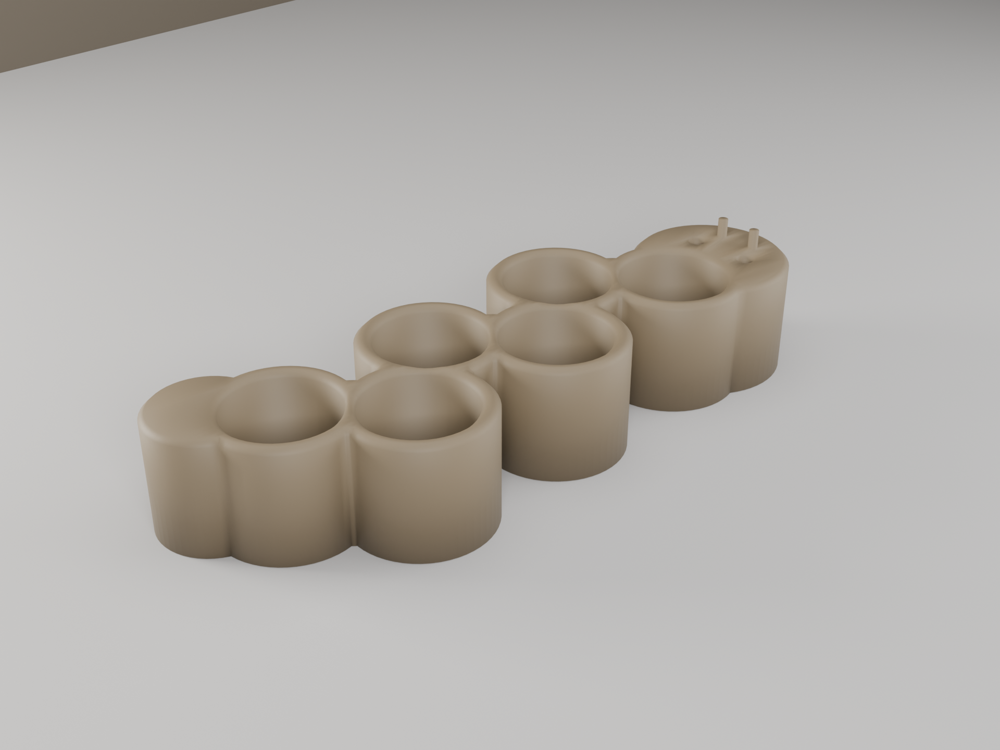
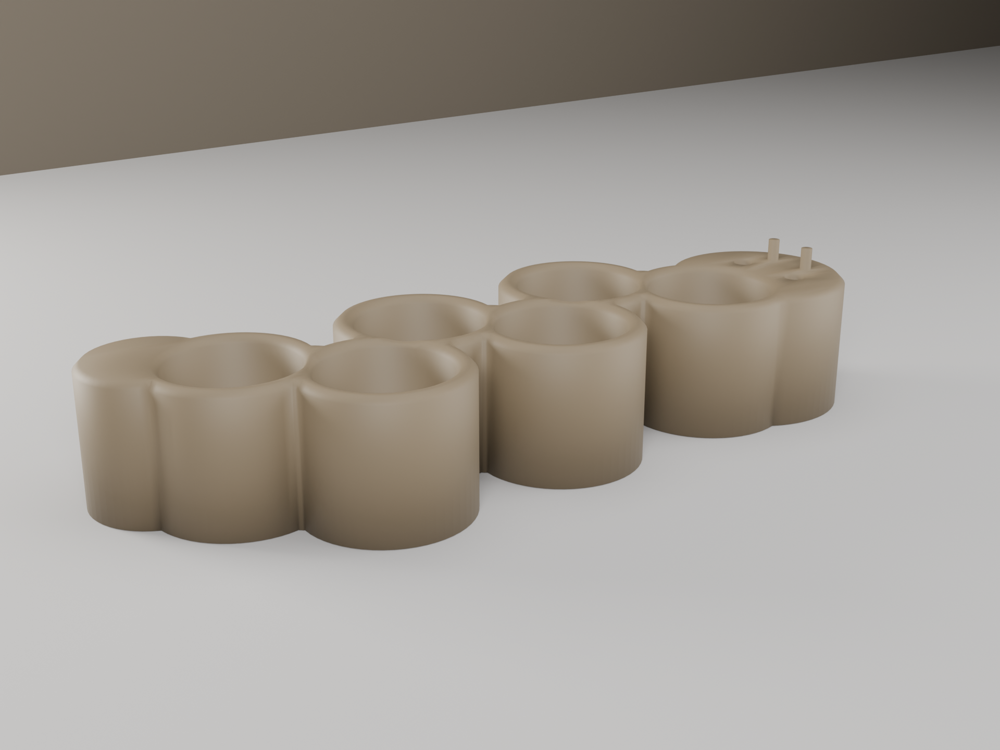
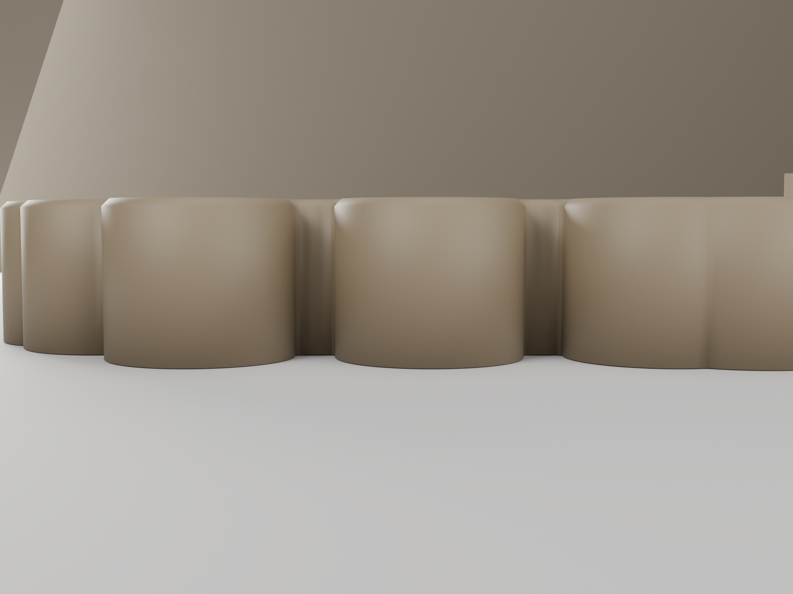

# Caterpillar 18650 Holder

A desk caddy that holds **6 bare 18650 cells** upright, shaped as a **zig-zag caterpillar** — a derivative of the [Caterpillar Capsule Holder](caterpillar-capsule-holder.md) retargeted for batteries. Same segmented body and character (rounded head with eyes + antenna nubs, tapered tail), but with round 18650 wells and a **nipple indent** in each socket floor so button-top cells can be inserted **positive-side-down** (negative flat end up).

> **Backend:** Fusion 360 (MCP). Built as a parametric derivative of the capsule caterpillar — teardrop pockets swapped for Ø19.2 mm bores, plus a floor recess for the positive button.

## Renders


*Hero — six Ø19.2 mm 18650 wells (18 mm deep) in a zig-zag chain; central nipple indent in each floor; head with eyes + antennae, tapered tail*


*Isometric — one bulged segment per cell; the zig-zag spine reads as the caterpillar's crawl*


*Front three-quarter — deep round wells, antenna nubs on the head lobe*


*Front elevation — 21 mm body (24.5 mm to the nub tops); segments alternate up/down*

## How it holds the cell

Insert each **button-top** 18650 **positive-side-down**:

```
   negative flat end up  ▲
   ┌───────────────┐
   │   18650 cell  │   stands ~47 mm proud
   ├───────────────┤  ← rests on the 18 mm floor ring (z = 3.0 mm)
   │ + button nub  │  ← nestles into the Ø7 mm × 1.8 mm nipple indent (z = 1.2 mm)
   └───────╥───────┘
        socket floor
```

The Ø19.2 mm bore is a loose drop-in fit (cell ~18.4 mm + ~0.4 mm/side). The central nipple indent clears the positive button so the cell body seats flat on the surrounding floor ring rather than balancing on the nub.

## Geometry

| Dimension | Value | Notes |
|-----------|-------|-------|
| Bounding box | 119.5 × 45.9 × 24.5 mm | z incl. 3.5 mm antenna nubs (body 21 mm) |
| Capacity | 6 cells | single zig-zag chain |
| Bore | Ø19.2 mm | 18650 ~18.4 + ~0.4 mm/side, loose drop-in |
| Socket depth | 18.0 mm | floor ring at z = 3.0 mm (ray-cast verified) |
| Nipple indent | Ø7 mm × 1.8 mm | positive-button clearance, floor z = 1.2 mm |
| Chain pitch | 15.25 mm | Y amplitude ±7 mm → ~42° zig-zag spine |
| Thinnest inter-bore wall | ~1.50 mm | ≥ 1.2 mm floor |
| Volume | 36.95 cm³ | watertight / manifold, single body |

## Printability

Single orientation, sockets up, no supports. Bore walls are vertical; the only overhang features are the 45°-capped rim chamfers and the short vertical antenna nubs. The nipple indent prints as a flat-bottomed blind recess in the floor (no bridging — solid below). Flat bottom for bed adhesion.

| Check | Result | Notes |
|-------|--------|-------|
| Overhangs | PASS | vertical bore walls; chamfers ≤ 45° |
| Bridges | PASS | none — blind bores + indents, solid below |
| Thin walls | PASS | thinnest inter-bore wall ~1.50 mm (≥ 1.2) |
| Watertight | PASS | manifold, single body |

## Validation

```
bbox:       119.5 × 45.9 × 24.5 mm                 PASS
watertight: true   body_count: 1                    PASS
bores:      6/6 Ø19.2 mm at 18.00 mm deep           PASS  (off-centre ray-cast floor z=3.00)
indents:    6/6 nipple recess, floor z=1.20 mm      PASS  (1.8 mm deep)
min wall:   ~1.50 mm  (floor 1.2)                    PASS
volume:     36.95 cm³                                PASS
```

## Print Settings

| Setting | Value |
|---------|-------|
| Orientation | Flat on bed, sockets facing up |
| Material | PLA |
| Layer height | 0.2 mm |
| Infill | 15% gyroid |
| Supports | None |

## Notes & variants

- Targets **unprotected button-top** 18650s. Protected/wrapped cells run fatter (~18.6–19 mm) and longer — widen `BORE_R` in `build.py` for those.
- **Flat-top** cells have no nub; they'll still drop in, just without using the indent.

## Downloads

| File | Description |
|------|-------------|
| [`caterpillar-18650-holder.stl`](../designs/caterpillar-18650-holder/output/caterpillar-18650-holder.stl) | Print-ready mesh (watertight) |
| [`build.py`](../designs/caterpillar-18650-holder/build.py) | Reproducible Fusion build script |
| [`modeling-report.md`](../designs/caterpillar-18650-holder/output/modeling-report.md) | Rationale + validation |
| [`MEASUREMENTS.md`](../designs/caterpillar-18650-holder/MEASUREMENTS.md) | 18650 reference dims + fit choices |

Built with the Fusion 360 MCP backend.
