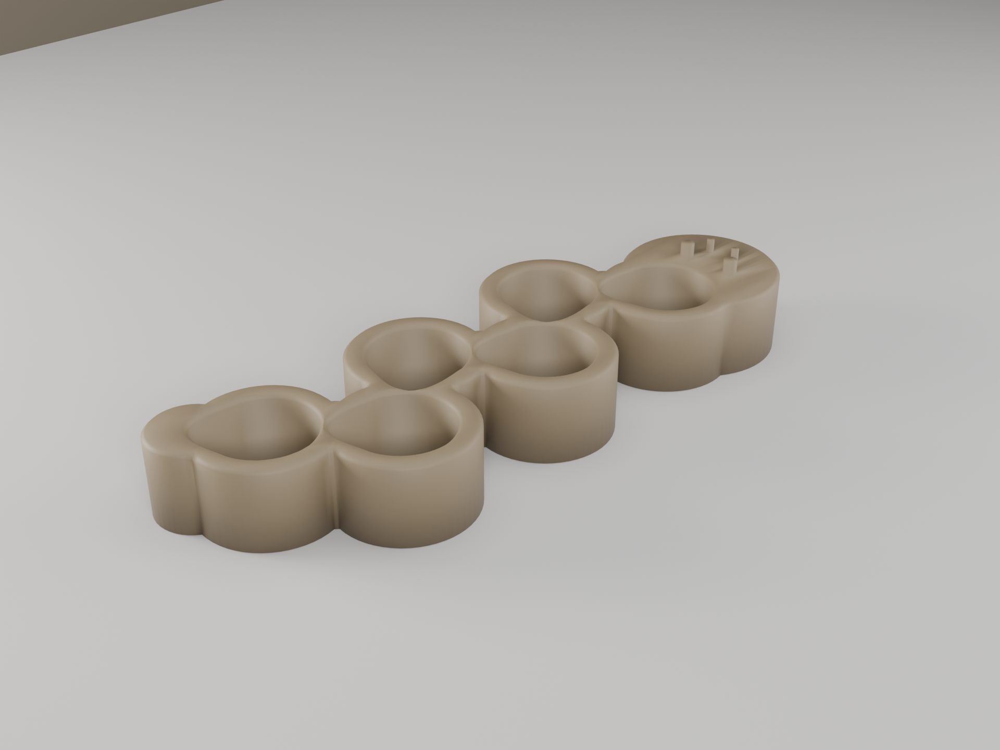
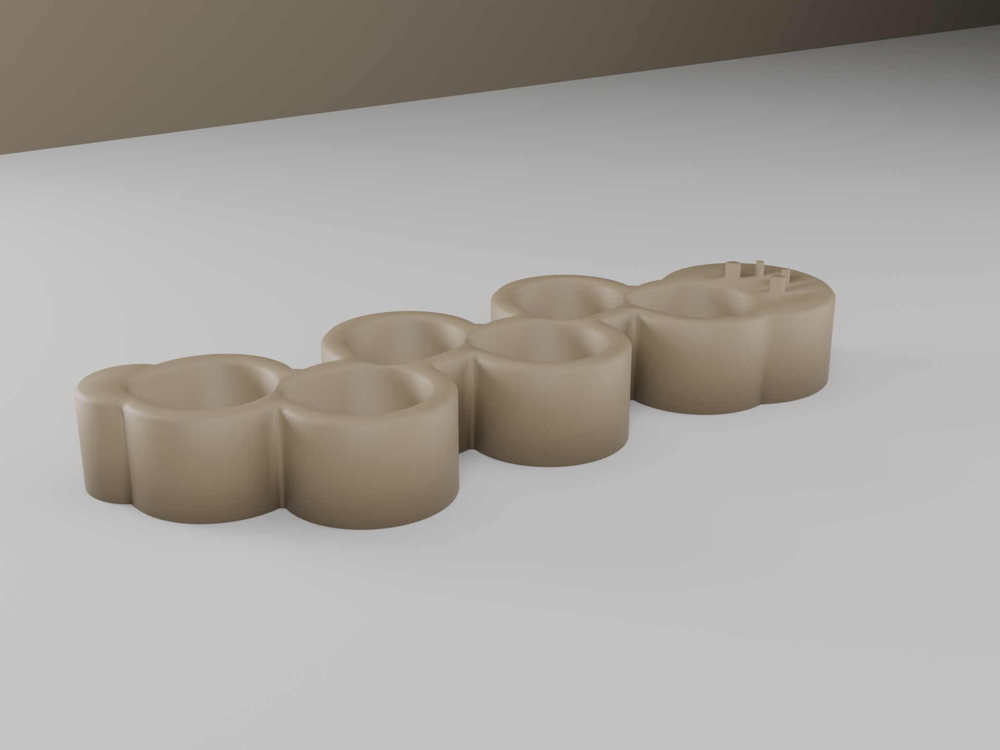
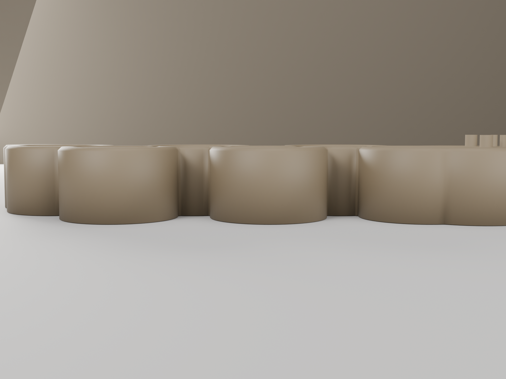

# Caterpillar Capsule Holder

A drawer caddy that holds **6 battery capsules** upright, shaped as a **zig-zag caterpillar**. The six teardrop sockets are strung into a single nose-to-tail nested chain that zig-zags down the body; the result reads as a segmented little caterpillar — a rounded head with two eye dimples and two antenna nubs at one end, a tapered tail at the other. Capsules drop into any segment, either end up, and the holder grips only the outer body (never the bore).

> **Backend:** Fusion 360 (MCP). Grew out of the [Battery Capsule Holder](battery-capsule-holder-openscad.md) studies (same calipered capsule, same fit rules) but is its own model — a characterful take rather than a utility tile.

## Renders


*Hero — six 18 mm teardrop sockets in a nose-to-tail zig-zag chain; segmented caterpillar body, head with eyes + antennae, tapered tail*


*Isometric — one bulged segment per capsule; the zig-zag spine reads as the caterpillar's crawl*


*Front three-quarter — deep recessed sockets, antenna nubs on the head lobe*


*Front elevation — 21 mm body (24.5 mm to the nub tops); the segments alternate up/down*

## Design Overview

The capsule is an asymmetric **27.8 × 23.7 mm** teardrop, **69 mm** tall closed (calipered). Each socket grips the **outer body only** in an **18 mm-deep blind socket**, so the same socket takes a capsule either end up and the seam/V higher up never touches a wall.

```
        zig-zag caterpillar chain  (≈42° spine)
         ___        ___        ___
   head ( o )      ( o )      ( o )            each socket 28.5 × 24.4 mm
   /◉◉\  \_/  \    /\_/   \   /\_/  \ tail      (0.35 mm/side loose drop-in)
         /   \  \_/    \  \_/    \  \_/         nose-to-tail nested, ~1.45 mm walls
       socket alternates ±10 mm above/below the spine
```

The six teardrops alternate ±10 mm across the spine and each points at the next, so the pointed end of one capsule nests alongside the fat lobe of the next. That interlock is what packs them tightly — the thinnest wall between any two pockets is ~1.45 mm — while the outer body bulges into one segment per capsule for the caterpillar silhouette.

## Geometry

| Dimension | Value | Notes |
|-----------|-------|-------|
| Bounding box | 169.1 × 61.5 × 24.5 mm | z incl. 3.5 mm antenna nubs (body 21 mm) |
| Capacity | 6 capsules | single zig-zag chain |
| Socket profile | 28.5 × 24.4 mm | capsule 27.8 × 23.7 + 0.35 mm/side |
| Socket depth | 18.0 mm | blind; floor at z = 3.0 mm (ray-cast verified) |
| Chain pitch | 22.3 mm | Y amplitude ±10 mm → ~42° zig-zag spine |
| Thinnest inter-socket wall | ~1.45 mm | ≥ 1.2 mm floor; tuned by wall optimizer |
| Rim lead-in | 1.0 mm × 45° chamfer | each of 6 sockets |
| Floor | 3.0 mm | solid; nothing enters the capsule bore |
| Volume | 77.7 cm³ | watertight / manifold, single body |

## Printability

Single orientation, sockets up, no supports. Pocket walls are vertical; the only overhang features are the 45°-capped rim chamfers and the short vertical antenna nubs. Flat bottom for bed adhesion and non-slip.

| Check | Result | Notes |
|-------|--------|-------|
| Overhangs | PASS | vertical socket walls; chamfers ≤ 45° |
| Bridges | PASS | none — blind sockets, solid floor |
| Thin walls | PASS | thinnest inter-socket wall ~1.45 mm (≥ 1.2) |
| Watertight | PASS | manifold, single body |

## Validation

```
bbox:       169.1 × 61.5 × 24.5 mm                 PASS
watertight: true                                    PASS
body_count: 1                                        PASS
pockets:    6/6 at 18.00 mm deep (ray-cast)          PASS
min wall:   ~1.45 mm  (floor 1.2)                    PASS
volume:     77.7 cm³                                 PASS
```

## Print Settings

| Setting | Value |
|---------|-------|
| Orientation | Flat on bed, sockets facing up |
| Material | PLA |
| Layer height | 0.2 mm |
| Infill | 15% gyroid |
| Supports | None |

## BOM

| Qty | Item | Notes |
|-----|------|-------|
| 1 | Caterpillar Capsule Holder (3D printed) | PLA, 77.7 cm³ (~96 g at 1.24 g/cm³) |

## Downloads

| File | Description |
|------|-------------|
| [`caterpillar-capsule-holder.stl`](../designs/caterpillar-capsule-holder/output/caterpillar-capsule-holder.stl) | Print-ready mesh (watertight) |
| [`build.py`](../designs/caterpillar-capsule-holder/build.py) | Reproducible Fusion build script |
| [`modeling-report.md`](../designs/caterpillar-capsule-holder/output/modeling-report.md) | Rationale + validation + provenance |
| [`MEASUREMENTS.md`](../designs/caterpillar-capsule-holder/MEASUREMENTS.md) | Caliper data |

Built with the Fusion 360 MCP backend.
