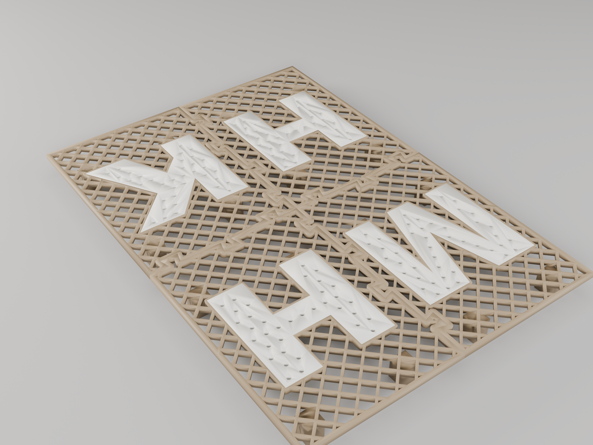
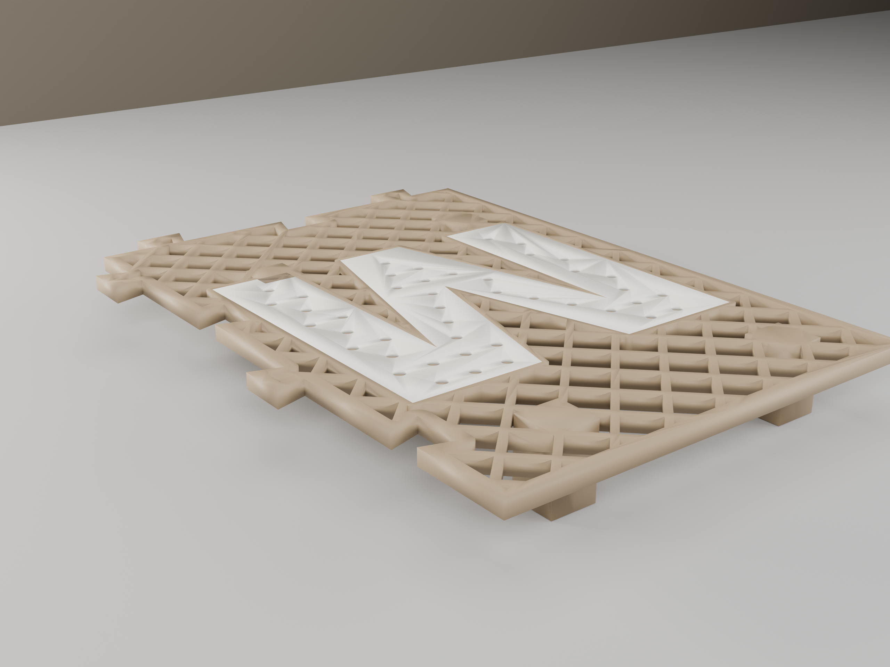

# Mailbox Stand-off Grate

A raised drainage grate that drops into a **leaky mailbox** to keep mail up out of the
water that pools on the floor. It floats the deck ~15 mm off the bottom on legs that
reach the true floor inboard of the caulked corners, so water drains straight through the
mesh and runs off underneath.

The interior is bigger than the print bed *and* the door, so the grate prints as **four
interlocking dovetail-jigsaw quadrants** (2×2) that slot together inside the box. The top
surface is a **continuous 45° cross-hatch mesh** with one **two-color letter** set into
each quadrant — **M / H / H / K**.

> **Backend:** dovetail tiles built in Fusion 360 (MCP); the cross-hatch mesh field,
> letters, two-color split, and 3MF bundling are generated container-side with
> shapely + trimesh (`build_perf_tiles.py`, `bundle_bicolor.py`) so the whole field is
> parametric and reproducible.

## Renders


*Hero (top-down) — the four quadrants assembled; continuous diamond mesh, two-color M/H/H/K letters*


*Three-quarter — mesh deck, dovetail seams, stand-off legs*


*Single M tile — cross-hatch field, solid drain-holed letter, dovetail teeth on the interior seams*

## How it assembles

Four quadrant tiles meet at a central cross seam. Each tile carries **re-entrant dovetail
teeth** along its two interior edges and matching notches (tooth + 0.2 mm clearance) for
its neighbours, so the pieces lock together **in-plane** (drop-in from above) and gravity
holds the assembly flat. The teeth sit on a solid 10 mm seam rail and are placed to
reinforce the 4-way center junction.

```
   plan view (back = far from door)
   ┌─────────┬─────────┐
   │    M    │    H     │   back row
   ├─────────┼─────────┤   ← central dovetail cross seam
   │    H    │    K     │   front row
   └─────────┴─────────┘
```

Each tile prints **letter-face-down** — the mesh + letter sit flat on the bed (the letter
becomes the smooth show face; flip the tile to use it). The **legs run the full height,
through the deck and flush with the show face**, so their ends land on the bed coplanar
with the deck and the legs rise as supported towers. Nothing is elevated → **no bridging,
no supports**.

## Geometry

| Dimension | Value | Notes |
|-----------|-------|-------|
| Assembled bbox | 237.6 × 339.2 × 19 mm | interior − 5 mm/side wall clearance; 15 mm legs + 4 mm deck |
| Quadrant print size | 126.8 × 177.6 mm | fits the 256 mm bed with room to spare |
| Deck thickness | 4.0 mm | flat mesh plate |
| Float height (legs) | 15.0 mm | deck underside to floor; clears caulk fillets + front lip |
| Field pattern | 45° cross-hatch mesh | 1.8 mm ribs, ~46 % open |
| Letters | Arial Black, two-color | mostly solid + Ø3.2 mm drain holes; color only the top 1 mm |
| Jigsaw clearance | 0.2 mm/side | re-entrant dovetail teeth |
| Legs | 4 per tile, ~12 mm sq | full-height through the deck, flush with the show face; ≥20 mm off side/back walls, front legs ≥30 mm behind the lip |
| Total volume | 228.4 cm³ | ≈ 283 g PLA across all four tiles |

## Printability

| Check | Result | Notes |
|-------|--------|-------|
| Overhangs | PASS | mesh + letters print flat on the bed; legs are vertical towers anchored to the bed |
| Bridges | PASS | none — full-height legs anchor the deck to the bed (no elevated layer) |
| Thin walls | PASS | 1.8 mm mesh ribs and 3 mm frame ≥ 1.2 mm min wall |
| Watertight (per tile) | PASS | each base + letter body manifold |
| Jigsaw interference | PASS | **0.0000 cm³** on all 6 pairwise quadrant checks |
| Fits bed | PASS | 126.8 × 177.6 mm per tile (256 mm bed) |

## Two-color printing

Each quadrant ships as a **`-bicolor.3mf`** containing two objects — the tan **base**
(mesh + frame + legs + the lower 3 mm of the letter) and the letter-color **cap** — already
print-oriented (letter face on the bed). Open it in Bambu Studio and assign one filament to
each object. The colored cap is **only the top 1 mm (~5 layers)** of the letter, printed
first against the bed, so it's a **single filament change** with no wasted second-color
volume. For a single-filament print, use the `tileperf-<id>.stl` reference mesh instead.

The slicer will **flag the two objects as touching/overlapping** — that's expected and
benign: the base and cap are complementary solids that meet at the `z=3` layer boundary
(the contact is ~10 µm of float noise, not real interpenetration). To silence the warning,
select both objects → right-click → **Assemble** into one object, then assign a filament
per part. Assign the **cap** (first layers off the bed) your letter color and the **base**
the tan — if the letter prints tan, the assignment is swapped.

## Validation

```
assembly bbox:   237.6 × 339.2 × 19.0 mm            PASS
per-tile fit:    126.8 × 177.6 mm  (256 bed)        PASS
jigsaw:          6/6 pairwise interference 0.0000cc PASS
watertight:      4/4 tiles (base + letter bodies)   PASS
field open:      ~46 % (target 40–50 %)             PASS
total material:  228.4 cm³ ≈ 283 g PLA              PASS
```

## Print Settings

| Setting | Value |
|---------|-------|
| Orientation | Letter face flat on bed, legs as towers (as bundled in the 3MF) |
| Material | PLA (PETG/ASA if it sags in summer mailbox heat) |
| Layer height | 0.2 mm |
| Supports | None |
| Filaments | 2 (base + letter) per `-bicolor.3mf`, or 1 for the reference STL |
| Recommended | Brim on the outer frame for bed adhesion |

## Downloads

| File | Description |
|------|-------------|
| [`M-bicolor.3mf`](../designs/mailbox-standoff-grate/output/print2c/M-bicolor.3mf) | Back-left quadrant, two-color |
| [`H-bicolor.3mf`](../designs/mailbox-standoff-grate/output/print2c/H-bicolor.3mf) | Back-right quadrant, two-color |
| [`H2-bicolor.3mf`](../designs/mailbox-standoff-grate/output/print2c/H2-bicolor.3mf) | Front-left quadrant, two-color |
| [`K-bicolor.3mf`](../designs/mailbox-standoff-grate/output/print2c/K-bicolor.3mf) | Front-right quadrant, two-color |
| [`assembly-perf.stl`](../designs/mailbox-standoff-grate/output/assembly-perf.stl) | Full assembled grate (preview/reference) |
| [`build_perf_tiles.py`](../designs/mailbox-standoff-grate/build_perf_tiles.py) | Reproducible mesh + letter + two-color generator |
| [`bundle_bicolor.py`](../designs/mailbox-standoff-grate/bundle_bicolor.py) | Print-orients + bundles each tile's 3MF |
| [`build_assembly.py`](../designs/mailbox-standoff-grate/build_assembly.py) | Fusion dovetail-tile builder (footprint source) |

Built with the Fusion 360 MCP backend + container-side shapely/trimesh field generation.
