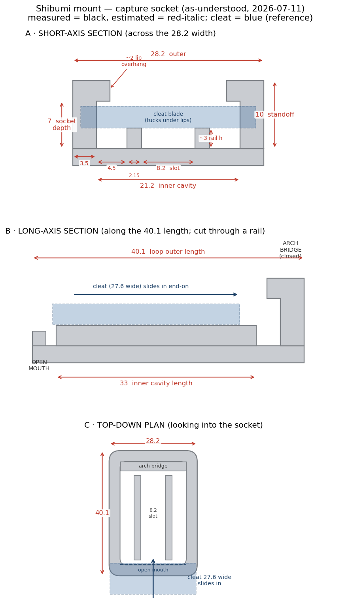
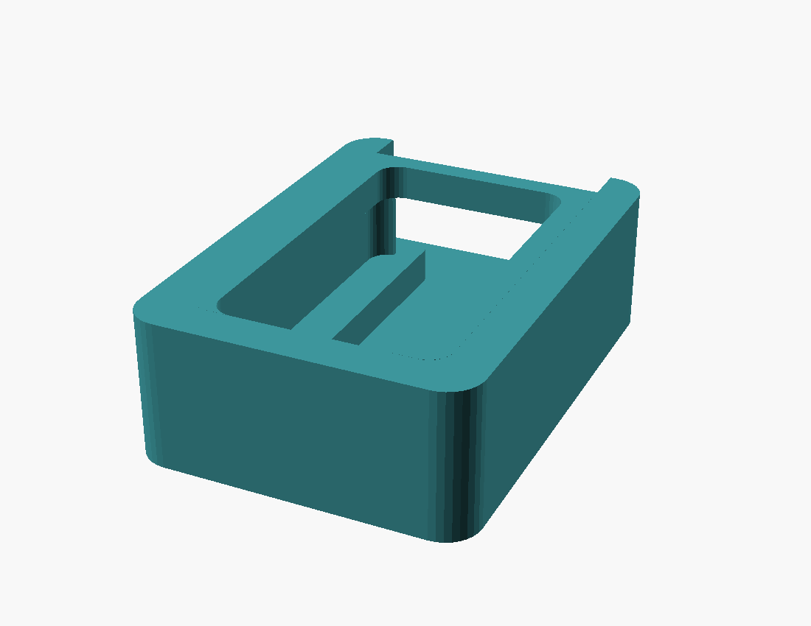
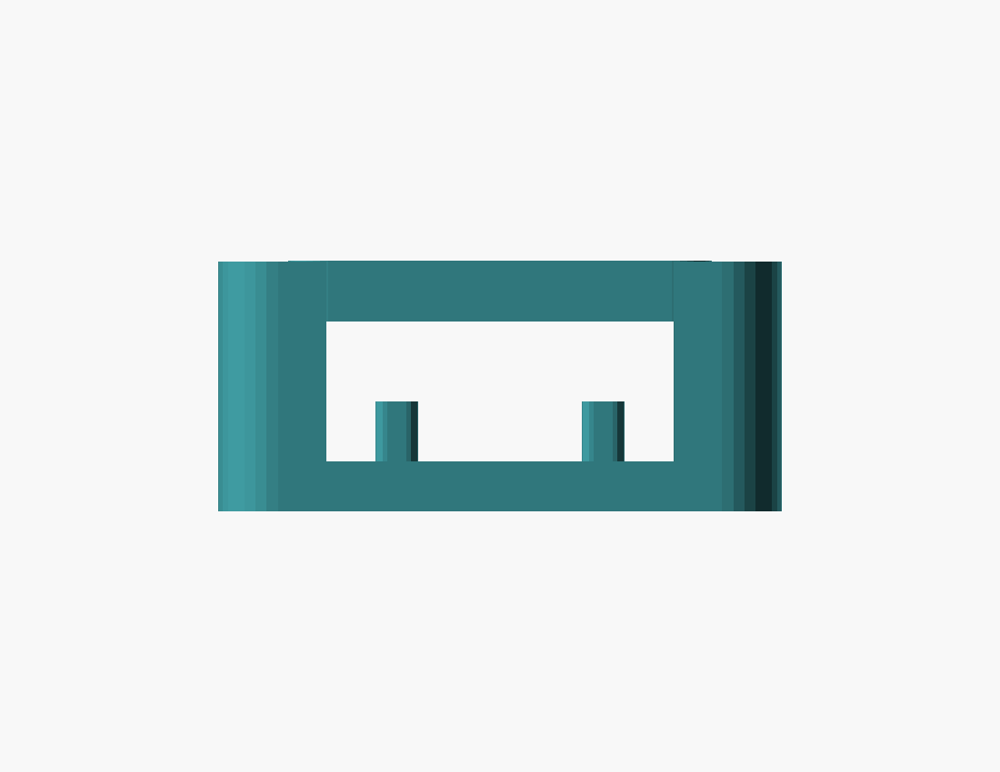

# Shibumi Mount Adapter — Phase 1 (capture socket)

> **Status: fit-test / in development.** This is Phase 1 of a small program: reproduce the
> beach-chair **attachment mechanism** dimensionally, print it, and dial in the fit against the
> real cleat. Later phases add holders (water bottle, table, phone/Kindle pocket) that reuse
> this same mount.

## What it is

A **slide-in capture socket** — the grey molded mount, sewn onto the neoprene sleeve on the side
of a Shibumi beach chair, that grabs a flat cleat on the chair frame. A flat cleat blade
(**27.6 mm wide × 4.02 mm thick**) enters the **open mouth end** and slides in **lengthwise**;
the two long side-wall tops **curl inward into lips** that trap the blade's back face, while two
thin floor **rails** set the blade's seating height. A closed **arch bridge** caps the far end.

The original's decorative concentric sewing terraces and flange (which only exist to stitch it to
the neoprene) are **dropped** — Phase 1 models just the functional socket on a minimal backing.

### Proofs — rendered from the actual STL

Looking into the open mouth (cavity, inward capture lips along the top edges, the inverted-U
floor rails, closed arch bridge at the back):

Short-axis section — outer walls, the inward capture lips stepping in at the top, the cavity, and
the two floor rails:

## How the dimensions were derived

There is no drawing for this part — it was reverse-engineered from **caliper photos** of the
original. Each reading was interpreted by four independent passes (Claude + Gemini + two blind
agents), reconciled, and cross-checked. The in-plane geometry closes on two independent sums, and
the owner's separately-measured cleat blade thickness validated the estimated socket depth:

- short-axis: `4.5 + 2.15 + 8.2 + 2.15 + 4.5 = 21.5 ≈ 21.2` cavity ✓
- capture gap: `rail 3 + blade 4.02 = 7.02 ≈` socket depth `7` ✓

| Feature | Value | Source |
|---|---:|---|
| Socket outer (W × L) | 28.2 × 40.1 mm | measured |
| Inner cavity (W × L) | 21.2 × ~33 mm | measured / est |
| Wall base thickness | 3.5 mm | measured |
| Capture lip overhang, per side | ~2 mm | est |
| Standoff height / socket depth | ~10 / ~7 mm | est |
| Floor rails: width / slot / offset | 2.15 / 8.2 / 4.5 mm | measured |
| Rail height | ~3 mm | est |
| Cleat blade (W × thick) *(ref, not modeled)* | 27.6 × 4.02 mm | measured |

Full reconciliation and photo mapping: [`reference/measurements.md`](../designs/shibumi-mount-adapter/reference/measurements.md).

## Fit-test tolerance ladder

The nominal capture gap (4.0 mm) sits right on the 4.02 mm blade — zero clearance, so it validates
the X-Y geometry but won't actually slide. To find the sweet spot in one print session, three
copies bracket the vertical clearance (varied via rail height):

| Piece | Capture gap | Clearance vs blade | Purpose |
|---|---:|---:|---|
| **A — nominal** | 4.0 mm | −0.02 (interference) | Validates outer/inner X-Y geometry; baseline |
| **B — snug** | 4.2 mm | +0.18 | Tight slide, positive grip |
| **C — sliding** | 4.35 mm | +0.33 | Easy slide (FDM sliding-fit target) |

Print all three, try each on the real cleat, and keep the one that slides on with a confident,
non-rattly grip. That result sets the clearance for the taper tuning in the next round.

## Printing

**Orientation matters.** Stand the part on its **closed arch end (mouth up)**, long axis vertical
— then the capture lips print as vertical wall features with **no overhang and no supports**.
(Printed flat with the opening up, the lip undersides become downward-facing overhangs that sag,
degrading the exact seating surface the cleat contacts.)

| Setting | Value |
|---|---|
| Orientation | Arch end on bed, mouth up (long axis vertical) |
| Layer height | 0.2 mm |
| Perimeters | 4 (makes the 2.15 mm rails fully solid) |
| Supports | None |
| Brim | 5 mm / 3 loops (tall-ish part on a small footprint) |
| Material | PLA for the fit test (final beach part likely PETG/ASA for UV + hot-trunk) |

**What to check off the bed:** outer 28.2 × 40.1; lip-to-lip opening ≈ 17.2 mm; rail height ≈ 3 mm;
then the slide-on — does it enter, bind, or slide, and can you feel the lips grip? Those Z numbers
(socket depth, rail height, lip overhang) are the photo-scaled estimates to calibrate.

## Roadmap

1. **This fit test** → pick the clearance that slides + grips.
2. **Internal taper** to the 4.02 mm blade for a wedge grip (rigid PLA doesn't flex like the soft
   original).
3. **Rebuild as a parametric Fusion base component** so the Phase-2 holders (bottle / table /
   phone / Kindle) can derive from a proven, shared mount interface.

## Downloads

- [Socket A — nominal (gap 4.0)](../designs/shibumi-mount-adapter/output/fit-test/socket-A-nominal-gap4.0.stl)
- [Socket B — snug (gap 4.2)](../designs/shibumi-mount-adapter/output/fit-test/socket-B-snug-gap4.2.stl)
- [Socket C — sliding (gap 4.35)](../designs/shibumi-mount-adapter/output/fit-test/socket-C-sliding-gap4.35.stl)
- Model: [`shibumi-mount-adapter.scad`](../designs/shibumi-mount-adapter/shibumi-mount-adapter.scad) (fully parametric)
